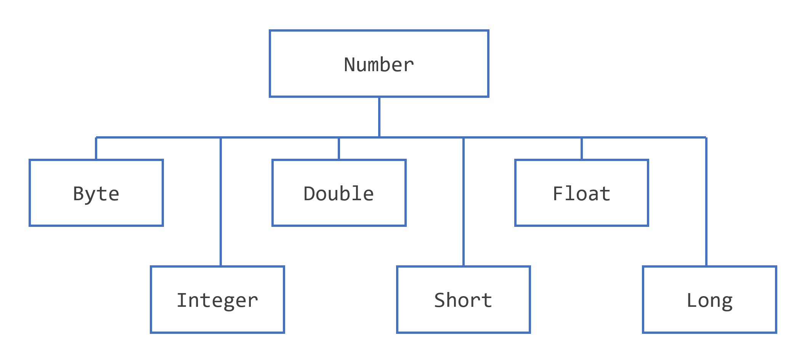
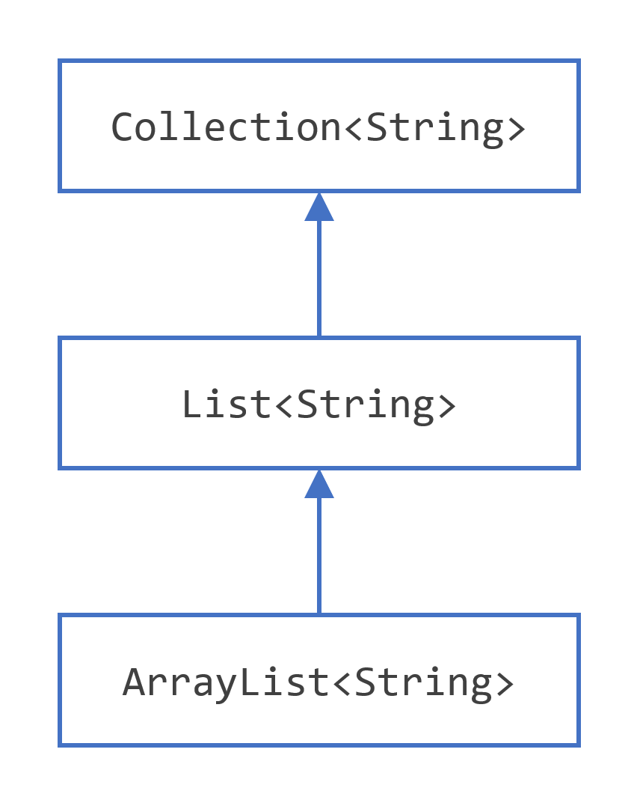
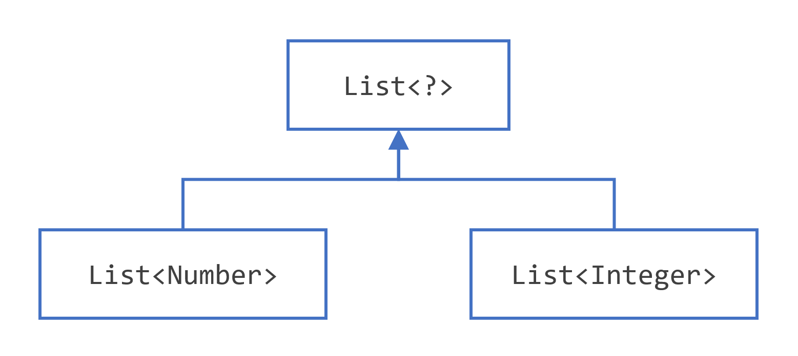
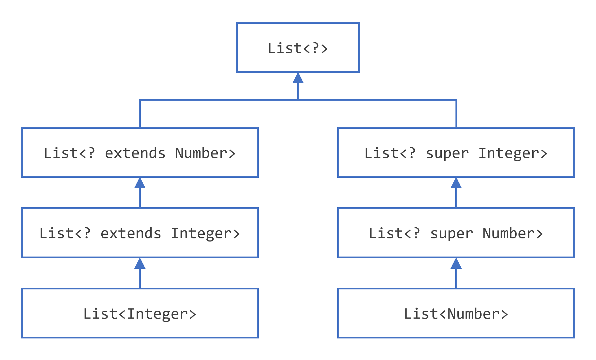

## Creating Variables and Naming Them

As you learned in the previous section, an object stores its state in fields.
```java
int cadence = 0;
int speed = 0;
```
In the Java programming language, the terms "**field**" and "**variable**" are both used

- **Instance Variables (Non-Static Fields)**
  - Objects store their individual states in "**non-static fields**", that is, fields declared without the **static** keyword.
  These are instance variables because their values are unique to each instance of a class
  - `private int cadence;
- **Class Variables (Static Fields)**
  - Is any field declared with the **static** modifier. It means there is exactly one copy of this variable in existence,
  regardless of how many times the class has been instantiated. The keyword **final** could be added to indicate that the number of gears will never change.
  - `private static int numberOfBicycles = 0;`
- **Local Variables**
  - A method will often store its temporary state in local variables. The syntax is similar to declaring a field (for example, int count = 0;).
  Local variables are only visible to the methods in which they are declared;
  they are not accessible from the rest of the class.
  - `int cadence;`
- **Parameters**
  - Recall that the signature for the main method is **public static void main(String[] args)**. Here, the args variable is the parameter to this method.
  Parameters are always classified as "variables" not "fields".
  - `public static void main(String[] args)`
- **Arguments**
  - Values which are passed to a method and match the parameters declaration type and order in the method.
  - 
- **Constant** 
  - The **static** modifier, in combination with the **final** modifier, is also used to define constants. The **final** modifier indicates that the value of this field cannot change.

## Naming Variables

* Variable names are case-sensitive.
* A variable's name can be any legal identifier — an unlimited-length sequence of Unicode letters and digits, beginning with a letter, the dollar sign $, or the underscore character _.
* If the name you choose consists of only one word, spell that word in all lowercase letters. If it consists of more than one word, capitalize the first letter of each subsequent word.
* If your variable stores a constant value, such as static final int NUM_GEARS = 6, the convention changes slightly, capitalizing every letter and separating subsequent words with the underscore character.


## Primitive types

- **byte**:
  - The byte data type is an 8-bit signed two's complement integer. It has a minimum value of -128 and a maximum value of 127 (inclusive).
- **short**:
  - The short data type is a 16-bit signed two's complement integer. It has a minimum value of -32,768 and a maximum value of 32,767 (inclusive)
- **int**:
  - By default, the int data type is a 32-bit signed two's complement integer, which has a minimum value of -2<sup>31</sup> and a maximum value of 2<sup>31</sup>-1
- **long**:
  - The long data type is a 64-bit two's complement integer. The signed long has a minimum value of -2<sup>63</sup> and a maximum value of 2<sup>63</sup>-1.
- **float**:
  - The float data type is a single-precision 32-bit IEEE 754 floating point. This data type **should never be used for precise values**, such as currency. For that, you will need to use the java.math.BigDecimal class instead.
- **double**:
  - The double data type is a double-precision 64-bit IEEE 754 floating point. For decimal values, this data type is generally the default choice. This data type should never be used for precise values, such as currency.
- **boolean**:
  - The boolean data type has only two possible values: true and false. Use this data type for simple flags that track true/false conditions. This data type represents one bit of information, but its "size" isn't something that's precisely defined.
- **char**:
  - The char data type is a single 16-bit Unicode character. It has a minimum value of \u0000 (or 0) and a maximum value of \uffff (or 65,535 inclusive).

you can use the **int** data type to represent an unsigned 32-bit integer, which has a minimum value of 0 and a maximum value of 2<sup>32</sup>-1.  Use the **Integer** class to use int data type as an unsigned integer.
you can use the **long** data type to represent an unsigned 64-bit long, which has a minimum value of 0 and a maximum value of 2<sup>64</sup>-1. Use **Long** class.

| Data Type              | Default Value (for fields) |
|------------------------|----------------------------|
| byte                   | 0                          |
| short                  | 0                          |
| int                    | 0                          |
| long                   | 0L                         |
| float                  | 0.0f                       |
| double                 | 0.0d                       |
| char                   | \u0000                     |
| String (or any object) | null                       |
| boolean                | false                      |

## Var declaration

Use the **var** type identifier to declare a local variable.
In doing so, you let the compiler decide what is the real type of the variable you create. Once created, this type cannot be changed.

```java
String message = "Hello world!";
// use instead
var message = "Hello world!";
```

Restriction:
* You can only use it for local variables declared in methods, constructors and initializer blocks.
* var cannot be used for fields, not for method or constructor parameters.
* The compiler must be able to choose a type when the variable is declared. Since null has no type, the variable must have an initializer.

## Operators

**Simple Assignment Operator**

| Operator | Description                | Example            |
|----------|----------------------------|--------------------|
| =        | Simple assignment operator | `int cadence = 0;` |

**Arithmetic Operators**

| Operator | Description                                            | Example                        |
|----------|--------------------------------------------------------|--------------------------------|
| +        | Additive operator (also used for String concatenation) | `int x = 1 + 2;`               |
| -        | Subtraction operator                                   | `x = x - 1; x -= 1; "a" + "b"` |
| *        | Multiplication operator                                | `x = x * 2; x *= 1;`           |
| /        | Division operator                                      | `x = x / 2; x /= 1;`           |
| %        | Remainder operator                                     | `x = x + 8; x += 1;`           |

**Unary Operators**

| Operator | Description                                                                                | Example                              |
|----------|--------------------------------------------------------------------------------------------|--------------------------------------|
| +        | Unary plus operator; indicates positive value (numbers are positive without this, however) | `int result = +1;`                   |
| -        | Unary minus operator; negates an expression                                                | `result = -result;`                  |
| ++       | Increment operator; increments a value by 1                                                | `result++;`                          |
| --       | Decrement operator; decrements a value by 1                                                | `result--;`                          |
| !        | Logical complement operator; inverts the value of a boolean                                | `boolean success = false; !success;` |

**Equality and Relational Operators**

| Operator | Description              | Example            |
|----------|--------------------------|--------------------|
| ==       | Equal to                 | `value1 == value2` |
| !=       | Not equal to             | `value1 != value2` |
| \>       | Greater than             | `value1 > value2`  |
| \>=      | Greater than or equal to | `value1 >= value2` |
| <        | Less than                | `value1 < value2`  |
| <=       | Less than or equal to    | `value1 <= value2` |

**Conditional Operators**

| Operator | Description                                    | Example                                     |
|----------|------------------------------------------------|---------------------------------------------|
| &&       | Conditional-AND                                | `(value1 == 1) && (value2 == 2)`            |
| \|\|     | Conditional-OR                                 | `(value1 == 1) \|\| (value2 == 1)`          |
| ?:       | Ternary (shorthand for if-then-else statement) | `result = someCondition ? value1 : value2;` |

**Type Comparison Operator**

| Operator   | Description                            | Example                  |
|------------|----------------------------------------|--------------------------|
| instanceof | Compares an object to a specified type | `obj1 instanceof Parent` |

**Bitwise and Bit Shift Operators**

```java
int bitmask = 0x000F;
int val = 0x2222;
// prints "2"
System.out.println(val & bitmask);
```
| Operator | Description              |
|----------|--------------------------|
| ~        | Unary bitwise complement | 
| <<       | Signed left shift        |
| \>\>     | Signed right shift       |
| \>\>\>   | Unsigned right shift     |
| &        | Bitwise AND              |
| ^        | Bitwise exclusive OR     |
| \|       | Bitwise inclusive OR     |      

## Using Switch Statements

You must choose the type of your selector variable among the following types:

* **byte**, **short**, **char**, and **int** primitive data types
* **Character**, **Byte**, **Short**, and **Integer** wrapper types
* enumerated types
* the **String** type.

The **switch** statements do not accept null selector values. If you try to switch on a null value you will get a **NullPointerException**.

# Class and Methods

**Naming**:
* It is the same as for variables
* the first letter of a class name should be capitalized
* the first (or only) word in a method name should be a verb
* the first letter of each of the second and following words should be capitalized

**Object privacy modifiers:**
* **public**  — the field is accessible from all classes.
* **private** — the field is accessible only within its own class.

Two of the components of a method declaration comprise the method signature—the method's name and the parameter types.

**Overloading** - means that methods within a class can have the same name if they have different parameter lists.
The compiler does not consider return type when differentiating methods
```java
public void draw(String s) {
    // ...
}
public void draw(int i) {
    // ...
}
```

**Constructor**

Its declarations look like method declarations—except that they use the name of the class and have no return type.
To create a new object, a constructor is called by the **new** operator.
Class can have multiple constructors, following the same rules as for **Overloading** methods.
A superclass has implicitly to have a no argument constructor
It is possible to use access modifiers in a constructor's declaration to control which other classes can call the constructor.

* A parameter can have the same name as one of the class's fields. If this is the case, the parameter is said to shadow the field.
* Primitive arguments, such as an int or a double, are passed into methods by value.
* If a class does not explicitly declare any, the Java compiler automatically provides a no-argument constructor, called the default constructor.
* Objects are passed to the constructor (method) by value also, but the new reference point to the same object.
* If present, the invocation of another constructor must be the first line in the constructor.

**Сovariant return type**

Means that the return type is allowed to vary in the same direction as the subclass.

`Object -> Number -> ImaginaryNumber`
```java
// We can return Number and ImaginaryNumber, but not Object
public Number returnNumber() {
    ...
}
```

**Access to Members of a Class**

Class

* **public** - the class is visible to all classes everywhere. If a class has no modifier, it is visible only within its own package

Members

* **public** - the member is visible everywhere. If a member has no modifier, it is visible only within its own package
* **private** - the member can only be accessed in its own class
* **protected** - the member can only be accessed within its own package and, by a subclass of its class in another package.

| Modifier        | Class | Package | Subclass | World |
|-----------------|-------|---------|----------|-------|
| **public**      | Y     | Y       | Y        | Y     |
| **protected**   | Y     | Y       | Y        | N     |
| **no modifier** | Y     | Y       | N        | N     |
| **private**     | Y     | N       | N        | N     |

### **Nested Classes**

Nested classes are divided into two categories: non-static and static. Non-static nested classes are called inner classes. Nested classes that are declared static are called static nested classes.
```java
class OuterClass {
    // ...
    class InnerClass {
        // ...
    }
    static class StaticNestedClass {
        // ...
    }
}
```

**Inner Classes**

It is associated with an instance of its enclosing class and has direct access to that object's methods and fields. Also, because an inner class is associated with an instance, it cannot define any static members itself.
```java
OuterClass outerObject = new OuterClass();
OuterClass.InnerClass innerObject = outerObject.new InnerClass();
```

**Static Nested Classes**

As with class methods and variables, a static nested class is associated with its outer class. And like static class methods, a static nested class cannot refer directly to instance variables or methods defined in its enclosing class

**Local Classes**

Local classes are classes that are defined in a block, which is a group of zero or more statements between balanced braces

* Local class can only access local variables that are declared **final**

**Anonymous Classes**

Anonymous classes are expressions. They enable you to declare and instantiate a class at the same time. They are like local classes except that they do not have a name. Use them if you need to use a local class only once.


### Records

Records are making the creation of immutable aggregates of data much simpler. A record is class declared with the **record** keyword instead of the **class** keywor
Compiler creates a **private final** field with the same name as this component.
```java
public record Point(int x, int y) {}
```
* It is an immutable class with two fields: **x** and **y**, of type **int**.
* It has a canonical constructor, to initialize these two fields.
* The toString(), equals() and hashCode() methods have been created for you by the compiler with a default behavior. Own implementation can be added
* It can implement the Serializable interface

There are three things that you cannot add to a record:

* You cannot declare any instance field in a record. You cannot add any instance field that would not correspond to a component.
* You cannot define any field initializer.
* You cannot add any instance initializer.
* You can create static fields with initializers and static initializers.

# Numbers and String



If you use a primitive where an object is expected, the compiler boxes the primitive in its wrapper class for you
Similarly, if you use a number object when a primitive is expected, the compiler unboxes the object for you.

**Strings**

The String class is immutable, so that once it is created a String object cannot be changed.
There are methods that actually change the string, what these methods really do is create and return a new string that contains the result of the operation.

**Autoboxing**

Is the automatic conversion that the Java compiler makes between the primitive types and their corresponding object wrapper classes.
For example, converting an **int** to an **Integer**, a **double** to a **Double**, and so on.
```java
List<Integer> ints = new ArrayList<>();
for (int i = 1; i < 50; i += 2)
    ints.add(i);
```

The Java compiler applies autoboxing when a primitive value is:

* Passed as a parameter to a method that expects an object of the corresponding wrapper class.
* Assigned to a variable of the corresponding wrapper class.

**Unboxing**

It's opposite to **Autoboxing**. Converting an object of a wrapper type to its corresponding primitive value is called unboxing.
For example, converting an **Integer** to an **int**, a **Double** to a **double**, and so on.
```java
public static void sumEven(List<Integer> ints) {
    int sum = 0;
    for (Integer i: ints) {
        if (i % 2 == 0) {
            sum+=i;
        }
    }
}
```
The Java compiler applies unboxing when an object of a wrapper class is:

* Passed as a parameter to a method that expects a value of the corresponding primitive type.
* Assigned to a variable of the corresponding primitive type.

| Primitive type | Wrapper class |
|----------------|---------------|
| boolean        | Boolean       |
| byte           | Byte          |
| char           | Character     |
| float          | Float         |
| int            | Integer       |
| long           | Long          |
| short          | Short         |
| double         | Double        |

# Inheritance

Excepting **Object**, which has no superclass, every class has one and only one direct superclass (single inheritance).
In the absence of any other explicit superclass, every class is implicitly a subclass of **Object**.

A subclass does not inherit the private members of its parent class.

Classes can have fields whereas interfaces cannot

**Casting Objects**

Casting shows the use of an object of one type in place of another type, among the objects permitted by inheritance and implementations.

```java
public class Bicycle { }
public class MountainBike extends Bicycle { }

Object obj = new MountainBike();
// or
Bicycle obj = new MountainBike();
```

**Explicit casting**
```java
Object obj = new MountainBike();
// compile-time error because obj is not known to the compiler to be a MountainBike 
MountainBike myBike = obj;
// tell the compiler that we promise to assign a MountainBike to obj by explicit casting
MountainBike myBike = (MountainBike)obj;
```

**Multiple Inheritance of State, Implementation, and Type**

Multiple inheritance of implementation is the ability to inherit method definitions from multiple classes.
Interfaces do not contain fields, you do not have to worry about problems that result from multiple inheritance of state.

The Java programming language supports multiple inheritance of type, which is the ability of a class to implement more than one interface.
An object can have multiple types: the type of its own class and the types of all the interfaces that the class implements.

**Overriding**

An overriding method can also return a subtype of the type returned by the overridden method. This subtype is called a covariant return type.

When overriding a method, it is better to use the **@Override** annotation that instructs the compiler that there is an intention to override a method in the superclass.
If, for some reason, the compiler detects that the method does not exist in one of the superclasses, then it will generate an error.

Use the **final** keyword in a method declaration to indicate that the method cannot be overridden by subclasses.

Methods called from constructors should generally be declared final. If a constructor calls a non-final method, a subclass may redefine that method with surprising or undesirable results.

An entire class can be defined as **final**. A class that is declared **final** cannot be subclassed.

The distinction between hiding a static method and overriding an instance method has important implications:
* The version of the overridden instance method that gets invoked is the one in the subclass.
* The version of the hidden static method that gets invoked depends on whether it is invoked from the superclass or the subclass.

**Interface Methods**

All **fields** are automatically **public, static, and final** (constants), and all methods that are declares or defines (as default methods) are **public**

When the supertypes of a class or interface provide multiple default methods with the same signature, the Java compiler follows inheritance rules to resolve the name conflict:
* Instance methods are preferred over interface default methods.
* If two or more independently defined default methods conflict, or a default method conflicts with an abstract method, then it's required explicitly to override the supertype methods.
```java
public class Horse {
    public String identifyMyself() { return "Horse."; }
}

public interface Flyer {
    default public String identifyMyself() { return "Fly."; }
}

public interface Mythical {
    default public String identifyMyself() { return "Mythical.";}
}

public class Pegasus extends Horse implements Flyer, Mythical {
    public static void main(String... args) {
        Pegasus myApp = new Pegasus();
        // Show: Horse.
        System.out.println(myApp.identifyMyself());
    }
}
```
```java
public interface OperateCar {
    default public int startEngine(EncryptedKey key) { return "OperateCar."; }
}

public interface FlyCar {
    default public int startEngine(EncryptedKey key) { return "OperateCar."; }
}

public class FlyingCar implements OperateCar, FlyCar {
    public int startEngine(EncryptedKey key) {
        FlyCar.super.startEngine(key);
        OperateCar.super.startEngine(key);
    }
}
```
The name preceding **super** must refer to a direct superinterface that defines or inherits a default for the invoked method.

**Modifiers**

The access specifier for an overriding method can allow more, but not less, access than the overridden method. For example, a protected instance method in the superclass can be made public, but not private, in the subclass.

**Abstract Methods and Classes**

An _abstract class_ is a class that is declared **abstract** — it may or may not include abstract methods.
Abstract classes cannot be instantiated, but they can be subclassed.
```java
public abstract class GraphicObject {
  // declare fields
  // declare nonabstract methods
   abstract void draw();
}
```
An _abstract method_ is a method that is declared without an implementation 
```java
abstract void moveTo(double deltaX, double deltaY);
```

Methods in an **interface** that are not declared as **default** or **static** are implicitly abstract,
so the abstract modifier is not used with interface methods. (It can be used, but it is unnecessary.)

It is possible to declare **fields** that are **not static and final**, and define **public**, **protected**, and **private** concrete methods.

# Interfaces

**Interface** is a reference type, similar to a class, that can contain only constants, method signatures, default methods, static methods (private or public, not protected),
instance non-abstract methods (private, not public, not protected), and nested types.
Method bodies exist only for default methods, private methods and static methods. Interfaces cannot be instantiated—they can only be implemented by classes or extended by other interfaces.

# Generics

A generic type is a generic class or interface that is parameterized over types

Generics were introduced to the Java language to provide tighter type checks at compile time and to support generic programming. To implement generics, the Java compiler applies type erasure to:

* Replace all type parameters in generic types with their bounds or Object if the type parameters are unbounded. The produced bytecode, therefore, contains only ordinary classes, interfaces, and methods.
* Insert type casts if necessary to preserve type safety.
* Generate bridge methods to preserve polymorphism in extended generic types.

Iti s defined with the following format:

```java
class name<T1, T2, ..., Tn> { /* ... */ }
```

This introduces the type variable, **T**, that can be used anywhere inside the class.

Without Generics
```java
List list = new ArrayList();
list.add("hello");
String s = (String) list.get(0);
```

With Generics
```java
List<String> list = new ArrayList<String>();
list.add("hello");
String s = list.get(0);   // no cast
```

**Another example**

Without Generics
```java
public class Box {
    private Object object;
    public void set(Object object) { this.object = object; }
    public Object get() { return object; }
}
```

With Generics
```java
public class Box<T> {
    private T t;
    public void set(T t) { this.t = t; }
    public T get() { return t; }
}
```
**Type Parameter Naming Conventions**

By convention, type parameter names are single, uppercase letters.

The most commonly used type parameter names are:
* **E** - Element (used extensively by the Java Collections Framework)
* **K** - Key
* **N** - Number
* **T** - Type
* **V** - Value
* **S**, **U**, **V** etc. - 2nd, 3rd, 4th types

**Bounded Type Parameters**

To declare a bounded type parameter, list the type parameter's name, followed by the **extends** keyword, followed by its upper bound
```java
```

```java
public class NaturalNumber<T extends Integer> {
    private T n;

    public <U extends Number> void inspect(U u) {
        //...
    }

  public static <T extends Comparable<T>> int countGreaterThan(T[] anArray, T elem) {
      int count = 0;
      for (T e : anArray)
          if (e.compareTo(elem) > 0)
              ++count;
      return count;
  }
}
```

**Generics, Inheritance, and Subtypes**

This is valid logic
```java
Box<Number> box = new Box<Number>();
box.add(new Integer(10));   // OK
box.add(new Double(10.1));  // OK
```
This is not a valid logic
```java
public void boxTest(Box<Number> n) { /* ... */ }
//...
public void test() {
    Box<Integer> box = new Box<Integer>();
    boxTest(box); // Fail
}
```
**Box\<Integer\>** and **Box\<Double\>** are not subtypes of **Box\<Number\>**, even though **Integer** is a subtype of **Number**.


Given two concrete types **A** and **B**, for example, **Number** and **Integer**, **MyClass\<A\>** has no relationship to **MyClass\<B\>**,
regardless of whether or not **A** and **B** are related. The common parent of **MyClass\<A\>** and **MyClass\<B\>** is **Object**.

**Generic Classes and Subtyping**

The relationship between the type parameters of one class or interface and the type parameters of another are determined by the extends and implements clauses.
Using the Collections classes as an example, **ArrayList\<E\>** implements **List\<E\>**, and **List\<E\>** extends **Collection\<E\>**


### Wildcard

**Upper Bounded Wildcards**

You can use an upper bounded wildcard to relax the restrictions on a variable.
you want to write a method that works on `List<Integer>`, `List<Double>`, and `List<Number>`

```java
public static void process(List<? extends Foo> list) {
    for (Foo elem : list) {
        // ...
    }
}

List<Integer> li = Arrays.asList(1, 2, 3);
process(li);

List<Double> ld = Arrays.asList(1.2, 2.3, 3.5);
process(ld);
```

**Unbounded Wildcards**

This is called a list of unknown type.
* If you are writing a method that can be implemented using functionality provided in the Object class.
* When the code is using methods in the generic class that do not depend on the type parameter. For example, `List.size()` or `List.clear()`. In fact, `Class<?>` is so often used because most of the methods in `Class<T>` do not depend on `T`.

```java
public static void printList(List<?> list) {
    for (Object elem: list)
        System.out.print(elem + " ");
}

List<Integer> li = Arrays.asList(1, 2, 3);
printList(li);

List<String>  ls = Arrays.asList("one", "two", "three");
printList(ls);
```

**Lower Bounded Wildcards**

To write the method that works on lists of `Integer` and the supertypes of `Integer`, such as `Integer`, `Number`, and `Object`,
you would specify `List<? super Integer>`.
The term `List<Integer>` is more restrictive than `List<? super Integer>` because the former matches a list of type `Integer` only,
whereas the latter matches a list of any type that is a supertype of `Integer`.

```java
public static void addNumbers(List<? super Integer> list) {
    for (int i = 1; i <= 10; i++) {
        list.add(i);
    }
}
```

**Wildcards and Subtyping**

Given that Integer is a subtype of `Number`, what is the relationship between `List<Integer>` and `List<Number>?`


In order to create a relationship between these classes so that the code can access Number's methods through `List<Integer>`'s elements,
use an upper bounded wildcard:
```java
List<? extends Integer> intList = new ArrayList<>();
// This is OK because List<? extends Integer> is a subtype of List<? extends Number>
List<? extends Number>  numList = intList;
```


**Wildcard Capture and Helper Methods**

In this example, the compiler processes the `i` input parameter as being of type `Object`.
When the foo method invokes `List.set(int, E)`, the compiler is not able to confirm the type of object that is being inserted into the list, and an error is produced.

```java
public class WildcardError {

    // This is WRONG and will get compile error
    void fooWrong(List<?> i) {
        i.set(0, i.get(0));
    }

    void fooCorrect(List<?> i) {
        fooHelper(i);
    }
    
    // Helper method created so that the wildcard can be captured
    // through type inference.
    private <T> void fooHelper(List<T> l) {
        l.set(0, l.get(0));
    }
}
```

### Restriction on Generics

* Cannot Instantiate Generic Types with Primitive Types.
  * When creating a `Pair` object, you cannot substitute a primitive type for the type parameter `K `or `V`:
```java
class Pair<K, V> { }

Pair<int, char> p = new Pair<>(8, 'a');  // compile-time error
// Note that the Java compiler autoboxes 8 to Integer.valueOf(8) and 'a' to Character('a'):
Pair<Integer, Character> p = new Pair<>(Integer.valueOf(8), new Character('a'));
```

* Cannot Create Instances of Type Parameters.
  * As a workaround, you can create an object of a type parameter through reflection:
```java
public static <E> void append(List<E> list, Class<E> cls) {
    E elem = new E();             // compile-time error
    E elem = cls.newInstance();   // OK
    list.add(elem);
}

List<String> ls = new ArrayList<>();
append(ls, String.class);
```

* Cannot Declare Static Fields Whose Types are Type Parameters
```java
public class MobileDevice<T> {
    private static T os; // Not allowed
}
```

* Cannot Use Casts or `instanceof` with Parameterized Types
  * Because the Java compiler erases all type parameters in generic code, you cannot verify which parameterized type for a generic type is being used at runtime
```java
public static <E> void rtti(List<E> list) {
    if (list instanceof ArrayList<Integer>) {  // compile-time error
        // ...
    }
}

// The most you can do is to use an unbounded wildcard to verify that the list is an ArrayList:

public static void rtti(List<?> list) {
  if (list instanceof ArrayList<?>) {  // OK; instanceof requires a reifiable type
    // ...
  }
}
```

* Cannot Create Arrays of Parameterized Types
```java
List<Integer>[] arrayOfLists = new List<Integer>[2];  // compile-time error
```

* Cannot Create, Catch, or Throw Objects of Parameterized Types
  * A generic class cannot extend the Throwable class directly or indirectly. For example, the following classes will not compile:
```java
// Extends Throwable indirectly
class MathException<T> extends Exception { /* ... */ }    // compile-time error

// Extends Throwable directly
class QueueFullException<T> extends Throwable { /* ... */ // compile-time error

// A method cannot catch an instance of a type parameter:

public static <T extends Exception, J> void execute(List<J> jobs) {
    try {
        for (J job : jobs)
        // ...
    } catch (T e) {   // compile-time error
        // ...
    }
}
```

* Cannot Overload a Method Where the Formal Parameter Types of Each Overload Erase to the Same Raw Type
```java
public class Example {
    public void print(Set<String> strSet) { }
    public void print(Set<Integer> intSet) { }
}
```

# Lambda Expression