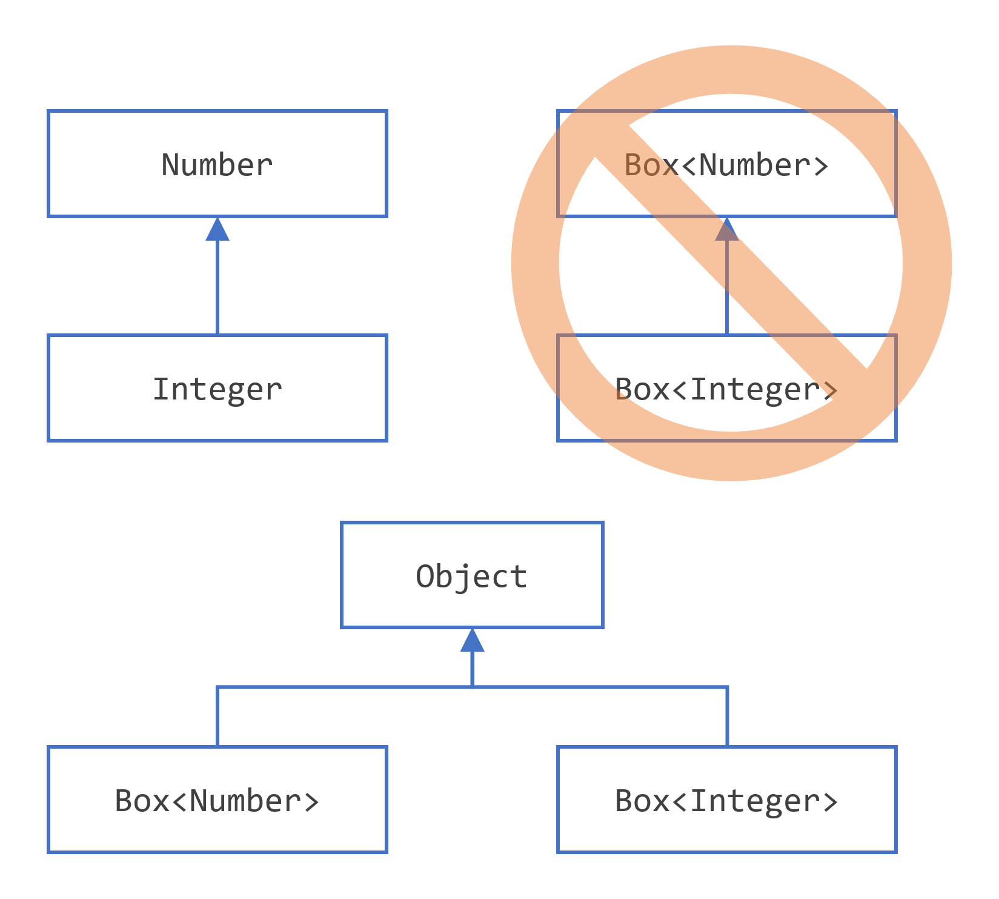
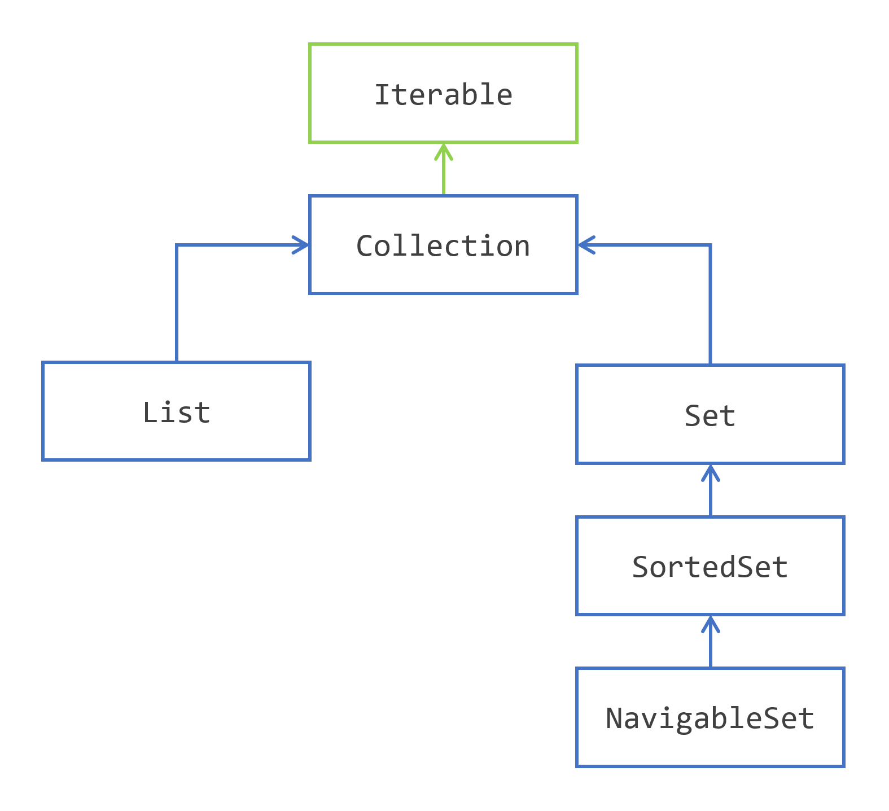
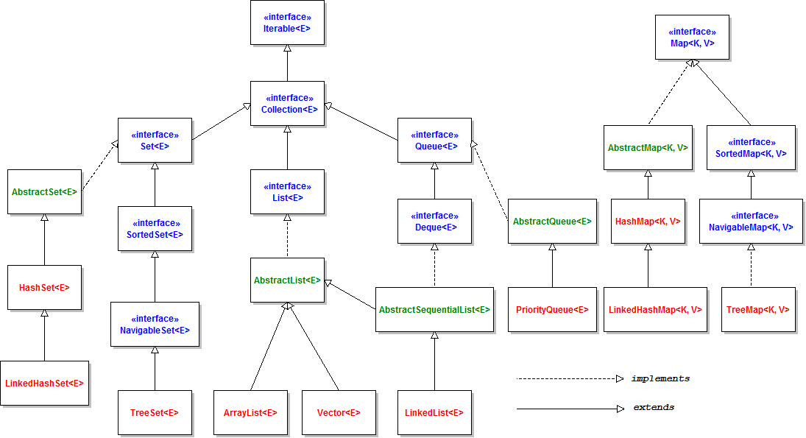
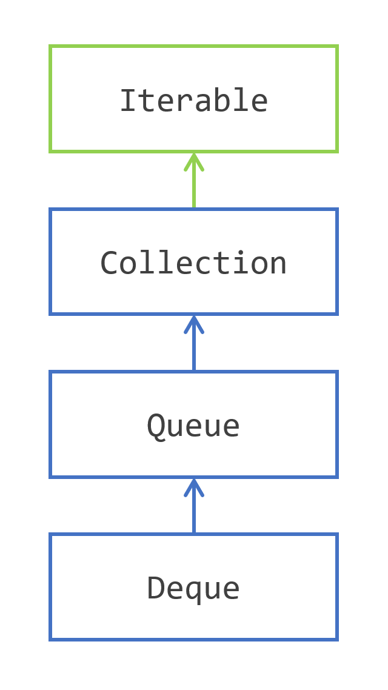
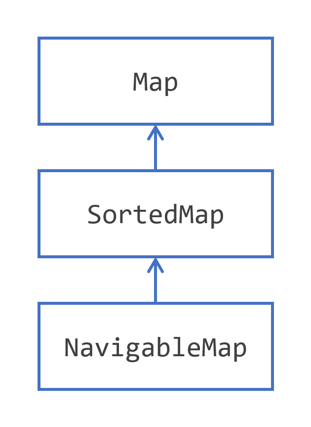

**SOURCE**: https://dev.java/learn/

<!-- TOC -->
* [Creating Variables and Naming Them](#creating-variables-and-naming-them)
  * [Naming Variables](#naming-variables)
  * [Primitive types](#primitive-types)
  * [Var declaration](#var-declaration)
* [Operators](#operators)
  * [Using Switch Statements](#using-switch-statements)
* [Class and Methods](#class-and-methods)
    * [**Nested Classes**](#nested-classes)
    * [Records](#records)
* [Numbers and String](#numbers-and-string)
* [Inheritance](#inheritance)
* [Interfaces](#interfaces)
* [Generics](#generics)
    * [Wildcard](#wildcard)
    * [Restriction on Generics](#restriction-on-generics)
* [Lambda Expression](#lambda-expression)
  * [System interfaces](#system-interfaces)
    * [`Supplier<T>`](#suppliert)
    * [`Consumer<T>`](#consumert)
    * [`BiConsumer<T, U>`](#biconsumert-u)
    * [` Predicate<T>`](#-predicatet)
    * [`BiPredicate<T, U>`](#bipredicatet-u)
    * [`Function<T, R>`](#functiont-r)
    * [`BiFunction<T, U, R>`](#bifunctiont-u-r)
  * [Expressions as Method References](#expressions-as-method-references)
    * [Static Method References](#static-method-references)
    * [Unbound Method References](#unbound-method-references)
    * [Bound Method References](#bound-method-references)
    * [Constructor Method References](#constructor-method-references)
    * [Wrapping Up](#wrapping-up-)
  * [Combining Lambda Expressions](#combining-lambda-expressions)
    * [Chaining Predicates with Default Methods](#chaining-predicates-with-default-methods)
    * [Chaining and Composing Functions](#chaining-and-composing-functions)
    * [Comparators](#comparators)
* [Annotations](#annotations)
  * [The Format of an Annotation](#the-format-of-an-annotation)
  * [Where Annotations Can Be Used](#where-annotations-can-be-used)
  * [Declaring an Annotation Type](#declaring-an-annotation-type)
  * [Predefined Annotation Types](#predefined-annotation-types)
    * [Annotations That Apply to Other Annotations](#annotations-that-apply-to-other-annotations)
  * [Retrieving Annotations](#retrieving-annotations)
* [Pattern Matching](#pattern-matching)
    * [Matching for `Instanceof`](#matching-for-instanceof)
    * [Matching for `Switch`](#matching-for-switch)
    * [Guarded Patterns](#guarded-patterns)
    * [`Record` Pattern](#record-pattern)
* [Exception](#exception)
    * [Try-with-resources](#try-with-resources)
* [Imperative to the Functional Style](#imperative-to-the-functional-style)
    * [Simple Loops `for() => range() or rangeClosed()`](#simple-loops-for--range-or-rangeclosed)
    * [Loops with Steps `for(...i = i + ...)  => iterate() with takeWhile()`](#loops-with-steps-fori--i-----iterate-with-takewhile)
    * [Foreach with if `foreach(...) { if... } => stream() with filter()`](#foreach-with-if-foreach--if---stream-with-filter)
    * [Iteration with transformation `foreach(...) { ...transform... } => stream() with map()`](#iteration-with-transformation-foreach--transform---stream-with-map)
* [The Collections Framework](#the-collections-framework)
  * [Collection](#collection)
    * [List vs. Collection](#list-vs-collection)
    * [Set vs. Collection](#set-vs-collection)
    * [ArrayList](#arraylist)
    * [Array](#array)
    * [Iterating over Collection](#iterating-over-collection)
    * [Set, HashSet](#set-hashset)
    * [Collections Factory Methods](#collections-factory-methods)
    * [Arrays and Collections](#arrays-and-collections)
    * [Modeling Queues and Stacks](#modeling-queues-and-stacks)
  * [Using Maps to Store Key Value Pairs](#using-maps-to-store-key-value-pairs)
<!-- TOC -->

# Creating Variables and Naming Them

As you learned in the previous section, an object stores its state in fields.
```java
int cadence = 0;
int speed = 0;
```
In the Java programming language, the terms "**field**" and "**variable**" are both used

- **Instance Variables (Non-Static Fields)**
  - Objects store their individual states in "**non-static fields**", that is, fields declared without the **static** keyword.
  These are instance variables because their values are unique to each instance of a class
  - `private int cadence;
- **Class Variables (Static Fields)**
  - Is any field declared with the **static** modifier. It means there is exactly one copy of this variable in existence,
  regardless of how many times the class has been instantiated. The keyword **final** could be added to indicate that the number of gears will never change.
  - `private static int numberOfBicycles = 0;`
- **Local Variables**
  - A method will often store its temporary state in local variables. The syntax is similar to declaring a field (for example, int count = 0;).
  Local variables are only visible to the methods in which they are declared;
  they are not accessible from the rest of the class.
  - `int cadence;`
- **Parameters**
  - Recall that the signature for the main method is **public static void main(String[] args)**. Here, the args variable is the parameter to this method.
  Parameters are always classified as "variables" not "fields".
  - `public static void main(String[] args)`
- **Arguments**
  - Values which are passed to a method and match the parameters declaration type and order in the method.
  - 
- **Constant** 
  - The **static** modifier, in combination with the **final** modifier, is also used to define constants. The **final** modifier indicates that the value of this field cannot change.

## Naming Variables

* Variable names are case-sensitive.
* A variable's name can be any legal identifier — an unlimited-length sequence of Unicode letters and digits, beginning with a letter, the dollar sign $, or the underscore character _.
* If the name you choose consists of only one word, spell that word in all lowercase letters. If it consists of more than one word, capitalize the first letter of each subsequent word.
* If your variable stores a constant value, such as static final int NUM_GEARS = 6, the convention changes slightly, capitalizing every letter and separating subsequent words with the underscore character.


## Primitive types

- **byte**:
  - The byte data type is an 8-bit signed two's complement integer. It has a minimum value of -128 and a maximum value of 127 (inclusive).
- **short**:
  - The short data type is a 16-bit signed two's complement integer. It has a minimum value of -32,768 and a maximum value of 32,767 (inclusive)
- **int**:
  - By default, the int data type is a 32-bit signed two's complement integer, which has a minimum value of -2<sup>31</sup> and a maximum value of 2<sup>31</sup>-1
- **long**:
  - The long data type is a 64-bit two's complement integer. The signed long has a minimum value of -2<sup>63</sup> and a maximum value of 2<sup>63</sup>-1.
- **float**:
  - The float data type is a single-precision 32-bit IEEE 754 floating point. This data type **should never be used for precise values**, such as currency. For that, you will need to use the java.math.BigDecimal class instead.
- **double**:
  - The double data type is a double-precision 64-bit IEEE 754 floating point. For decimal values, this data type is generally the default choice. This data type should never be used for precise values, such as currency.
- **boolean**:
  - The boolean data type has only two possible values: true and false. Use this data type for simple flags that track true/false conditions. This data type represents one bit of information, but its "size" isn't something that's precisely defined.
- **char**:
  - The char data type is a single 16-bit Unicode character. It has a minimum value of \u0000 (or 0) and a maximum value of \uffff (or 65,535 inclusive).

you can use the **int** data type to represent an unsigned 32-bit integer, which has a minimum value of 0 and a maximum value of 2<sup>32</sup>-1.  Use the **Integer** class to use int data type as an unsigned integer.
you can use the **long** data type to represent an unsigned 64-bit long, which has a minimum value of 0 and a maximum value of 2<sup>64</sup>-1. Use **Long** class.

| Data Type              | Default Value (for fields) |
|------------------------|----------------------------|
| byte                   | 0                          |
| short                  | 0                          |
| int                    | 0                          |
| long                   | 0L                         |
| float                  | 0.0f                       |
| double                 | 0.0d                       |
| char                   | \u0000                     |
| String (or any object) | null                       |
| boolean                | false                      |

## Var declaration

Use the **var** type identifier to declare a local variable.
In doing so, you let the compiler decide what is the real type of the variable you create. Once created, this type cannot be changed.

```java
String message = "Hello world!";
// use instead
var message = "Hello world!";
```

Restriction:
* You can only use it for local variables declared in methods, constructors and initializer blocks.
* var cannot be used for fields, not for method or constructor parameters.
* The compiler must be able to choose a type when the variable is declared. Since null has no type, the variable must have an initializer.

# Operators

**Simple Assignment Operator**

| Operator | Description                | Example            |
|----------|----------------------------|--------------------|
| =        | Simple assignment operator | `int cadence = 0;` |

**Arithmetic Operators**

| Operator | Description                                            | Example                        |
|----------|--------------------------------------------------------|--------------------------------|
| +        | Additive operator (also used for String concatenation) | `int x = 1 + 2;`               |
| -        | Subtraction operator                                   | `x = x - 1; x -= 1; "a" + "b"` |
| *        | Multiplication operator                                | `x = x * 2; x *= 1;`           |
| /        | Division operator                                      | `x = x / 2; x /= 1;`           |
| %        | Remainder operator                                     | `x = x + 8; x += 1;`           |

**Unary Operators**

| Operator | Description                                                                                | Example                              |
|----------|--------------------------------------------------------------------------------------------|--------------------------------------|
| +        | Unary plus operator; indicates positive value (numbers are positive without this, however) | `int result = +1;`                   |
| -        | Unary minus operator; negates an expression                                                | `result = -result;`                  |
| ++       | Increment operator; increments a value by 1                                                | `result++;`                          |
| --       | Decrement operator; decrements a value by 1                                                | `result--;`                          |
| !        | Logical complement operator; inverts the value of a boolean                                | `boolean success = false; !success;` |

**Equality and Relational Operators**

| Operator | Description              | Example            |
|----------|--------------------------|--------------------|
| ==       | Equal to                 | `value1 == value2` |
| !=       | Not equal to             | `value1 != value2` |
| \>       | Greater than             | `value1 > value2`  |
| \>=      | Greater than or equal to | `value1 >= value2` |
| <        | Less than                | `value1 < value2`  |
| <=       | Less than or equal to    | `value1 <= value2` |

**Conditional Operators**

| Operator | Description                                    | Example                                     |
|----------|------------------------------------------------|---------------------------------------------|
| &&       | Conditional-AND                                | `(value1 == 1) && (value2 == 2)`            |
| \|\|     | Conditional-OR                                 | `(value1 == 1) \|\| (value2 == 1)`          |
| ?:       | Ternary (shorthand for if-then-else statement) | `result = someCondition ? value1 : value2;` |

**Type Comparison Operator**

| Operator   | Description                            | Example                  |
|------------|----------------------------------------|--------------------------|
| instanceof | Compares an object to a specified type | `obj1 instanceof Parent` |

**Bitwise and Bit Shift Operators**

```java
int bitmask = 0x000F;
int val = 0x2222;
// prints "2"
System.out.println(val & bitmask);
```
| Operator | Description              |
|----------|--------------------------|
| ~        | Unary bitwise complement | 
| <<       | Signed left shift        |
| \>\>     | Signed right shift       |
| \>\>\>   | Unsigned right shift     |
| &        | Bitwise AND              |
| ^        | Bitwise exclusive OR     |
| \|       | Bitwise inclusive OR     |      

## Using Switch Statements

You must choose the type of your selector variable among the following types:

* **byte**, **short**, **char**, and **int** primitive data types
* **Character**, **Byte**, **Short**, and **Integer** wrapper types
* enumerated types
* the **String** type.

The **switch** statements do not accept null selector values. If you try to switch on a null value you will get a **NullPointerException**.

# Class and Methods

**Naming**:
* It is the same as for variables
* the first letter of a class name should be capitalized
* the first (or only) word in a method name should be a verb
* the first letter of each of the second and following words should be capitalized

**Object privacy modifiers:**
* **public**  — the field is accessible from all classes.
* **private** — the field is accessible only within its own class.

Two of the components of a method declaration comprise the method signature—the method's name and the parameter types.

**Overloading** - means that methods within a class can have the same name if they have different parameter lists.
The compiler does not consider return type when differentiating methods
```java
public void draw(String s) {
    // ...
}
public void draw(int i) {
    // ...
}
```

**Constructor**

Its declarations look like method declarations—except that they use the name of the class and have no return type.
To create a new object, a constructor is called by the **new** operator.
Class can have multiple constructors, following the same rules as for **Overloading** methods.
A superclass has implicitly to have a no argument constructor
It is possible to use access modifiers in a constructor's declaration to control which other classes can call the constructor.

* A parameter can have the same name as one of the class's fields. If this is the case, the parameter is said to shadow the field.
* Primitive arguments, such as an int or a double, are passed into methods by value.
* If a class does not explicitly declare any, the Java compiler automatically provides a no-argument constructor, called the default constructor.
* Objects are passed to the constructor (method) by value also, but the new reference point to the same object.
* If present, the invocation of another constructor must be the first line in the constructor.

**Сovariant return type**

Means that the return type is allowed to vary in the same direction as the subclass.

`Object -> Number -> ImaginaryNumber`
```java
// We can return Number and ImaginaryNumber, but not Object
public Number returnNumber() {
    ...
}
```

**Access to Members of a Class**

Class

* **public** - the class is visible to all classes everywhere. If a class has no modifier, it is visible only within its own package

Members

* **public** - the member is visible everywhere. If a member has no modifier, it is visible only within its own package
* **private** - the member can only be accessed in its own class
* **protected** - the member can only be accessed within its own package and, by a subclass of its class in another package.

| Modifier        | Class | Package | Subclass | World |
|-----------------|-------|---------|----------|-------|
| **public**      | Y     | Y       | Y        | Y     |
| **protected**   | Y     | Y       | Y        | N     |
| **no modifier** | Y     | Y       | N        | N     |
| **private**     | Y     | N       | N        | N     |

### **Nested Classes**

Nested classes are divided into two categories: non-static and static. Non-static nested classes are called inner classes. Nested classes that are declared static are called static nested classes.
```java
class OuterClass {
    // ...
    class InnerClass {
        // ...
    }
    static class StaticNestedClass {
        // ...
    }
}
```

**Inner Classes**

It is associated with an instance of its enclosing class and has direct access to that object's methods and fields. Also, because an inner class is associated with an instance, it cannot define any static members itself.
```java
OuterClass outerObject = new OuterClass();
OuterClass.InnerClass innerObject = outerObject.new InnerClass();
```

**Static Nested Classes**

As with class methods and variables, a static nested class is associated with its outer class. And like static class methods, a static nested class cannot refer directly to instance variables or methods defined in its enclosing class

**Local Classes**

Local classes are classes that are defined in a block, which is a group of zero or more statements between balanced braces

* Local class can only access local variables that are declared **final**

**Anonymous Classes**

Anonymous classes are expressions. They enable you to declare and instantiate a class at the same time. They are like local classes except that they do not have a name. Use them if you need to use a local class only once.


### Records

Records are making the creation of immutable aggregates of data much simpler. A record is class declared with the **record** keyword instead of the **class** keywor
Compiler creates a **private final** field with the same name as this component.
```java
public record Point(int x, int y) {}
```
* It is an immutable class with two fields: **x** and **y**, of type **int**.
* It has a canonical constructor, to initialize these two fields.
* The toString(), equals() and hashCode() methods have been created for you by the compiler with a default behavior. Own implementation can be added
* It can implement the Serializable interface

There are three things that you cannot add to a record:

* You cannot declare any instance field in a record. You cannot add any instance field that would not correspond to a component.
* You cannot define any field initializer.
* You cannot add any instance initializer.
* You can create static fields with initializers and static initializers.

# Numbers and String


If you use a primitive where an object is expected, the compiler boxes the primitive in its wrapper class for you
Similarly, if you use a number object when a primitive is expected, the compiler unboxes the object for you.

**Strings**

The String class is immutable, so that once it is created a String object cannot be changed.
There are methods that actually change the string, what these methods really do is create and return a new string that contains the result of the operation.

**Autoboxing**

Is the automatic conversion that the Java compiler makes between the primitive types and their corresponding object wrapper classes.
For example, converting an **int** to an **Integer**, a **double** to a **Double**, and so on.
```java
List<Integer> ints = new ArrayList<>();
for (int i = 1; i < 50; i += 2)
    ints.add(i);
```

The Java compiler applies autoboxing when a primitive value is:

* Passed as a parameter to a method that expects an object of the corresponding wrapper class.
* Assigned to a variable of the corresponding wrapper class.

**Unboxing**

It's opposite to **Autoboxing**. Converting an object of a wrapper type to its corresponding primitive value is called unboxing.
For example, converting an **Integer** to an **int**, a **Double** to a **double**, and so on.
```java
public static void sumEven(List<Integer> ints) {
    int sum = 0;
    for (Integer i: ints) {
        if (i % 2 == 0) {
            sum+=i;
        }
    }
}
```
The Java compiler applies unboxing when an object of a wrapper class is:

* Passed as a parameter to a method that expects a value of the corresponding primitive type.
* Assigned to a variable of the corresponding primitive type.

| Primitive type | Wrapper class |
|----------------|---------------|
| boolean        | Boolean       |
| byte           | Byte          |
| char           | Character     |
| float          | Float         |
| int            | Integer       |
| long           | Long          |
| short          | Short         |
| double         | Double        |

# Inheritance

Excepting **Object**, which has no superclass, every class has one and only one direct superclass (single inheritance).
In the absence of any other explicit superclass, every class is implicitly a subclass of **Object**.

A subclass does not inherit the private members of its parent class.

Classes can have fields whereas interfaces cannot

**Casting Objects**

Casting shows the use of an object of one type in place of another type, among the objects permitted by inheritance and implementations.

```java
public class Bicycle { }
public class MountainBike extends Bicycle { }

Object obj = new MountainBike();
// or
Bicycle obj = new MountainBike();
```

**Explicit casting**
```java
Object obj = new MountainBike();
// compile-time error because obj is not known to the compiler to be a MountainBike 
MountainBike myBike = obj;
// tell the compiler that we promise to assign a MountainBike to obj by explicit casting
MountainBike myBike = (MountainBike)obj;
```

**Multiple Inheritance of State, Implementation, and Type**

Multiple inheritance of implementation is the ability to inherit method definitions from multiple classes.
Interfaces do not contain fields, you do not have to worry about problems that result from multiple inheritance of state.

The Java programming language supports multiple inheritance of type, which is the ability of a class to implement more than one interface.
An object can have multiple types: the type of its own class and the types of all the interfaces that the class implements.

**Overriding**

An overriding method can also return a subtype of the type returned by the overridden method. This subtype is called a covariant return type.

When overriding a method, it is better to use the **@Override** annotation that instructs the compiler that there is an intention to override a method in the superclass.
If, for some reason, the compiler detects that the method does not exist in one of the superclasses, then it will generate an error.

Use the **final** keyword in a method declaration to indicate that the method cannot be overridden by subclasses.

Methods called from constructors should generally be declared final. If a constructor calls a non-final method, a subclass may redefine that method with surprising or undesirable results.

An entire class can be defined as **final**. A class that is declared **final** cannot be subclassed.

The distinction between hiding a static method and overriding an instance method has important implications:
* The version of the overridden instance method that gets invoked is the one in the subclass.
* The version of the hidden static method that gets invoked depends on whether it is invoked from the superclass or the subclass.

**Interface Methods**

All **fields** are automatically **public, static, and final** (constants), and all methods that are declares or defines (as default methods) are **public**

When the supertypes of a class or interface provide multiple default methods with the same signature, the Java compiler follows inheritance rules to resolve the name conflict:
* Instance methods are preferred over interface default methods.
* If two or more independently defined default methods conflict, or a default method conflicts with an abstract method, then it's required explicitly to override the supertype methods.
```java
public class Horse {
    public String identifyMyself() { return "Horse."; }
}

public interface Flyer {
    default public String identifyMyself() { return "Fly."; }
}

public interface Mythical {
    default public String identifyMyself() { return "Mythical.";}
}

public class Pegasus extends Horse implements Flyer, Mythical {
    public static void main(String... args) {
        Pegasus myApp = new Pegasus();
        // Show: Horse.
        System.out.println(myApp.identifyMyself());
    }
}
```
```java
public interface OperateCar {
    default public int startEngine(EncryptedKey key) { return "OperateCar."; }
}

public interface FlyCar {
    default public int startEngine(EncryptedKey key) { return "OperateCar."; }
}

public class FlyingCar implements OperateCar, FlyCar {
    public int startEngine(EncryptedKey key) {
        FlyCar.super.startEngine(key);
        OperateCar.super.startEngine(key);
    }
}
```
The name preceding **super** must refer to a direct superinterface that defines or inherits a default for the invoked method.

**Modifiers**

The access specifier for an overriding method can allow more, but not less, access than the overridden method. For example, a protected instance method in the superclass can be made public, but not private, in the subclass.

**Abstract Methods and Classes**

An _abstract class_ is a class that is declared **abstract** — it may or may not include abstract methods.
Abstract classes cannot be instantiated, but they can be subclassed.
```java
public abstract class GraphicObject {
  // declare fields
  // declare nonabstract methods
   abstract void draw();
}
```
An _abstract method_ is a method that is declared without an implementation 
```java
abstract void moveTo(double deltaX, double deltaY);
```

Methods in an **interface** that are not declared as **default** or **static** are implicitly abstract,
so the abstract modifier is not used with interface methods. (It can be used, but it is unnecessary.)

It is possible to declare **fields** that are **not static and final**, and define **public**, **protected**, and **private** concrete methods.

# Interfaces

**Interface** is a reference type, similar to a class, that can contain only constants, method signatures, default methods, static methods (private or public, not protected),
instance non-abstract methods (private, not public, not protected), and nested types.
Method bodies exist only for default methods, private methods and static methods. Interfaces cannot be instantiated—they can only be implemented by classes or extended by other interfaces.

# Generics

A generic type is a generic class or interface that is parameterized over types

Generics were introduced to the Java language to provide tighter type checks at compile time and to support generic programming. To implement generics, the Java compiler applies type erasure to:

* Replace all type parameters in generic types with their bounds or Object if the type parameters are unbounded. The produced bytecode, therefore, contains only ordinary classes, interfaces, and methods.
* Insert type casts if necessary to preserve type safety.
* Generate bridge methods to preserve polymorphism in extended generic types.

Iti s defined with the following format:

```java
class name<T1, T2, ..., Tn> { /* ... */ }
```

This introduces the type variable, **T**, that can be used anywhere inside the class.

Without Generics
```java
List list = new ArrayList();
list.add("hello");
String s = (String) list.get(0);
```

With Generics
```java
List<String> list = new ArrayList<String>();
list.add("hello");
String s = list.get(0);   // no cast
```

**Another example**

Without Generics
```java
public class Box {
    private Object object;
    public void set(Object object) { this.object = object; }
    public Object get() { return object; }
}
```

With Generics
```java
public class Box<T> {
    private T t;
    public void set(T t) { this.t = t; }
    public T get() { return t; }
}
```
**Type Parameter Naming Conventions**

By convention, type parameter names are single, uppercase letters.

The most commonly used type parameter names are:
* **E** - Element (used extensively by the Java Collections Framework)
* **K** - Key
* **N** - Number
* **T** - Type
* **V** - Value
* **S**, **U**, **V** etc. - 2nd, 3rd, 4th types

**Bounded Type Parameters**

To declare a bounded type parameter, list the type parameter's name, followed by the **extends** keyword, followed by its upper bound
```java
```

```java
public class NaturalNumber<T extends Integer> {
    private T n;

    public <U extends Number> void inspect(U u) {
        //...
    }

  public static <T extends Comparable<T>> int countGreaterThan(T[] anArray, T elem) {
      int count = 0;
      for (T e : anArray)
          if (e.compareTo(elem) > 0)
              ++count;
      return count;
  }
}
```

**Generics, Inheritance, and Subtypes**

This is valid logic
```java
Box<Number> box = new Box<Number>();
box.add(new Integer(10));   // OK
box.add(new Double(10.1));  // OK
```
This is not a valid logic
```java
public void boxTest(Box<Number> n) { /* ... */ }
//...
public void test() {
    Box<Integer> box = new Box<Integer>();
    boxTest(box); // Fail
}
```
**Box\<Integer\>** and **Box\<Double\>** are not subtypes of **Box\<Number\>**, even though **Integer** is a subtype of **Number**.


Given two concrete types **A** and **B**, for example, **Number** and **Integer**, **MyClass\<A\>** has no relationship to **MyClass\<B\>**,
regardless of whether or not **A** and **B** are related. The common parent of **MyClass\<A\>** and **MyClass\<B\>** is **Object**.

**Generic Classes and Subtyping**

The relationship between the type parameters of one class or interface and the type parameters of another are determined by the extends and implements clauses.
Using the Collections classes as an example, **ArrayList\<E\>** implements **List\<E\>**, and **List\<E\>** extends **Collection\<E\>**


### Wildcard

**Upper Bounded Wildcards**

You can use an upper bounded wildcard to relax the restrictions on a variable.
you want to write a method that works on `List<Integer>`, `List<Double>`, and `List<Number>`

```java
public static void process(List<? extends Foo> list) {
    for (Foo elem : list) {
        // ...
    }
}

List<Integer> li = Arrays.asList(1, 2, 3);
process(li);

List<Double> ld = Arrays.asList(1.2, 2.3, 3.5);
process(ld);
```

**Unbounded Wildcards**

This is called a list of unknown type.
* If you are writing a method that can be implemented using functionality provided in the Object class.
* When the code is using methods in the generic class that do not depend on the type parameter. For example, `List.size()` or `List.clear()`. In fact, `Class<?>` is so often used because most of the methods in `Class<T>` do not depend on `T`.

```java
public static void printList(List<?> list) {
    for (Object elem: list)
        System.out.print(elem + " ");
}

List<Integer> li = Arrays.asList(1, 2, 3);
printList(li);

List<String>  ls = Arrays.asList("one", "two", "three");
printList(ls);
```

**Lower Bounded Wildcards**

To write the method that works on lists of `Integer` and the supertypes of `Integer`, such as `Integer`, `Number`, and `Object`,
you would specify `List<? super Integer>`.
The term `List<Integer>` is more restrictive than `List<? super Integer>` because the former matches a list of type `Integer` only,
whereas the latter matches a list of any type that is a supertype of `Integer`.

```java
public static void addNumbers(List<? super Integer> list) {
    for (int i = 1; i <= 10; i++) {
        list.add(i);
    }
}
```

**Wildcards and Subtyping**

Given that Integer is a subtype of `Number`, what is the relationship between `List<Integer>` and `List<Number>?`


In order to create a relationship between these classes so that the code can access Number's methods through `List<Integer>`'s elements,
use an upper bounded wildcard:
```java
List<? extends Integer> intList = new ArrayList<>();
// This is OK because List<? extends Integer> is a subtype of List<? extends Number>
List<? extends Number>  numList = intList;
```


**Wildcard Capture and Helper Methods**

In this example, the compiler processes the `i` input parameter as being of type `Object`.
When the foo method invokes `List.set(int, E)`, the compiler is not able to confirm the type of object that is being inserted into the list, and an error is produced.

```java
public class WildcardError {

    // This is WRONG and will get compile error
    void fooWrong(List<?> i) {
        i.set(0, i.get(0));
    }

    void fooCorrect(List<?> i) {
        fooHelper(i);
    }
    
    // Helper method created so that the wildcard can be captured
    // through type inference.
    private <T> void fooHelper(List<T> l) {
        l.set(0, l.get(0));
    }
}
```

### Restriction on Generics

* Cannot Instantiate Generic Types with Primitive Types.
  * When creating a `Pair` object, you cannot substitute a primitive type for the type parameter `K `or `V`:
```java
class Pair<K, V> { }

Pair<int, char> p = new Pair<>(8, 'a');  // compile-time error
// Note that the Java compiler autoboxes 8 to Integer.valueOf(8) and 'a' to Character('a'):
Pair<Integer, Character> p = new Pair<>(Integer.valueOf(8), new Character('a'));
```

* Cannot Create Instances of Type Parameters.
  * As a workaround, you can create an object of a type parameter through reflection:
```java
public static <E> void append(List<E> list, Class<E> cls) {
    E elem = new E();             // compile-time error
    E elem = cls.newInstance();   // OK
    list.add(elem);
}

List<String> ls = new ArrayList<>();
append(ls, String.class);
```

* Cannot Declare Static Fields Whose Types are Type Parameters
```java
public class MobileDevice<T> {
    private static T os; // Not allowed
}
```

* Cannot Use Casts or `instanceof` with Parameterized Types
  * Because the Java compiler erases all type parameters in generic code, you cannot verify which parameterized type for a generic type is being used at runtime
```java
public static <E> void rtti(List<E> list) {
    if (list instanceof ArrayList<Integer>) {  // compile-time error
        // ...
    }
}

// The most you can do is to use an unbounded wildcard to verify that the list is an ArrayList:

public static void rtti(List<?> list) {
  if (list instanceof ArrayList<?>) {  // OK; instanceof requires a reifiable type
    // ...
  }
}
```

* Cannot Create Arrays of Parameterized Types
```java
List<Integer>[] arrayOfLists = new List<Integer>[2];  // compile-time error
```

* Cannot Create, Catch, or Throw Objects of Parameterized Types
  * A generic class cannot extend the Throwable class directly or indirectly. For example, the following classes will not compile:
```java
// Extends Throwable indirectly
class MathException<T> extends Exception { /* ... */ }    // compile-time error

// Extends Throwable directly
class QueueFullException<T> extends Throwable { /* ... */ // compile-time error

// A method cannot catch an instance of a type parameter:

public static <T extends Exception, J> void execute(List<J> jobs) {
    try {
        for (J job : jobs)
        // ...
    } catch (T e) {   // compile-time error
        // ...
    }
}
```

* Cannot Overload a Method Where the Formal Parameter Types of Each Overload Erase to the Same Raw Type
```java
public class Example {
    public void print(Set<String> strSet) { }
    public void print(Set<Integer> intSet) { }
}
```

# Lambda Expression

There is a restriction on the type of a lambda expression: it has to be a functional interface.
So an anonymous class that does not implement a functional interface cannot be written as a lambda expression.
**Functional interface** is an interface that has only one abstract method, default and static methods do not count.
```java
@FunctionalInterface
public interface Runnable {
    public abstract void run();
}
```
`@FunctionalInterface` annotation has been added as a helper, but it is not needed.

Lambda expression you are writing is an implementation of the abstract method from the functional interface.
Lambda is an instance of the interface.

```java
@FunctionalInterface
public interface Predicate<T> {
    boolean test(T t);
}

Predicate<String> predicate = (String s) -> {
      return s.length() == 3;
  };
// or
Predicate<String> predicateFnSimpler = s -> s.length() == 3;

predicate.test("one");
```

Constraints:
* Variable used in lambda expression should be `final` or `effectively final`. Lambdas cannot modify variables defined outside their body
  * Lambdas cannot capture variables, they can only capture values. A final variable is in fact a value.


There are 4 categories of interfaces:
* the suppliers: do not take any argument, return something
* the consumers: take an argument, do not return anything
* the predicates: take an argument, return a boolean
* the functions: take an argument, return something

Some interfaces have versions that take two arguments instead of one:
* the biconsumers
* the bipredicates
* the bifunctions

Some interfaces have specialized versions, added to avoid boxing and unboxing

## System interfaces

### `Supplier<T>`

https://docs.oracle.com/en/java/javase/23/docs/api/java.base/java/util/function/Supplier.html

```java
Random random = new Random(314L);
Supplier<Integer> newRandom = () -> random.nextInt(10);

int i = 12;
Integer integer = i;
```

To work with primitive types there are relevant functional interfaces as:
* `DoubleSupplier`
* `IntSupplier`
* `LongSupplier`
* `BooleanSupplier`

### `Consumer<T>`

https://docs.oracle.com/en/java/javase/23/docs/api/java.base/java/util/function/Consumer.html

```java
Random random = new Random(314L);
int nextRandom = newRandom.getAsInt();

Consumer<String> printer = s -> System.out.println(s);
printer.accept("next random = " + nextRandom);

Consumer<Integer> printer = i -> System.out.println(i);
printer.accept(nextRandom);
```

To work with primitive types there are relevant functional interfaces as:
* `IntConsumer`
* `LongConsumer`
* `DoubleConsumer`

### `BiConsumer<T, U>`

Same as `Consumer<T>`, but it takes 2 arguments

```java
BiConsumer<Random, Integer> randomNumberPrinter =
    (random, number) -> {
        for (int i = 0; i < number; i++) {
            System.out.println("next random = " + random.nextInt());
        }
    };

randomNumberPrinter.accept(new Random(314L), 5));
```

To handle primitive types:
* `ObjIntConsumer<T>`
* `ObjLongConsumer<T>`
* `ObjDoubleConsumer<T>`

### ` Predicate<T>`

A predicate is used to test an object. It is used for filtering streams in the Stream API, a topic that you will see later on.
```java
Predicate<String> length3 = s -> s.length() == 3;

String word = "Oak";
boolean isOfLength3 = length3.test(word);

IntPredicate isGreaterThan10 = i -> i > 10;
boolean isOfLength3 = length3.testAsInt(word);
```

To handle primitive types:
* `IntPredicate`
* `LongPredicate`
* `DoublePredicate`

### `BiPredicate<T, U>`

```java
Predicate<String, Integer> isOfLength = (word, length) -> word.length() == length;

String word = "Hello";
int length = 5;
boolean isWordOfLength3 = isOfLength.test(word, length);
```

### `Function<T, R>`

The abstract method of a function takes an object of type T and returns a transformation of that object to any other type U

```java
Function<String, Integer> toLength = s -> s.length();
String word = "Hello";
int length = toLength.apply(word);
```

| Parameter types | `T`                   | `int`                 | `long`                 | `double`               |
|-----------------|-----------------------|-----------------------|------------------------|------------------------|
| `T`             | `UnaryOperator<T>`    | `IntFunction<T>`      | `LongFunction<T>`      | `DoubleFunction<T>`    |
| `int`           | `ToIntFunction<T>`    | `IntUnaryOperator`    | `LongToIntFunction`    | `DoubleToIntFunction`  |
| `long`          | `ToLongFunction<T>`   | `IntToLongFunction`   | `LongUnaryOperator`    | `DoubleToLongFunction` |
| `double`        | `ToDoubleFunction<T>` | `IntToDoubleFunction` | `LongToDoubleFunction` | `DoubleUnaryOperator`  |


### `BiFunction<T, U, R>`

The interface is `BiFunction<T, U, R>`, where `T` and `U` are the arguments and `R` the returned type

```java
BiFunction<String, String, Integer> findWordInSentence = (word, sentence) -> sentence.indexOf(word);
```

* `BinaryOperator<T>` (= `BiFunction<T, T, T>`)
* `IntBinaryOperator`
* `LongBinaryOperator`
* `DoubleBinaryOperator`
* `ToIntBiFunction<T>`
* `ToLongBiFunction<T>`
* `ToDoubleBiFunction<T>`

## Expressions as Method References

```java
Consumer<String> printer = System.out::println;
```

There are four categories of method references:
* Static method references
* Bound method references
* Unbound method references
* Constructor method references

### Static Method References

The general syntax of a static method reference is: `RefType::staticMethod`

```java
DoubleUnaryOperator sqrt = a -> Math.sqrt(a);
DoubleUnaryOperator sqrt = Math::sqrt;

IntBinaryOperator max = (a, b) -> Integer.max(a, b);
IntBinaryOperator max = Integer::max;
```
### Unbound Method References

The general syntax of a unbound method reference is the following: `RefType:instanceMethod`

```java
Function<String, Integer> toLength = s -> s.length();
Function<String, Integer> toLength = String::length;

Function<User, String> getName = user -> user.getName();
Function<User, String> getName = User::getName;

```

### Bound Method References

The general syntax of a bound method reference is the following: `expr:instanceMethod`
This method reference is called a bound method reference.
This method reference is called bound because the object on which the method is called is defined in the method reference itself.
So this call is bound to the object given in the method reference.

```java
Consumer<String> printer = System.out::println;
```
### Constructor Method References

```java
Supplier<List<String>> newListOfStrings = ArrayList::new;
// or
Supplier<List<String>> newListOfStrings = ArrayList<String>::new;
```

### Wrapping Up 
| Name            | Syntax                    | Lambda equivalent                           |
|-----------------|---------------------------|---------------------------------------------|
| **Static**      | `RefType::staticMethod`   | `(args) -> RefType.staticMethod(args)`      |
| **Bound**       | `expr::instanceMethod`    | `(args) -> expr.instanceMethod(args)`       |
| **Unbound**     | `RefType::instanceMethod` | `(arg0, rest) -> arg0.instanceMethod(rest)` |
| **Constructor** | `ClassName::new`          | `(args) -> new ClassName(args)`             |

## Combining Lambda Expressions

### Chaining Predicates with Default Methods

To filter method  by multiple rules we can do
```java
Predicate<String> p = s -> (s != null) && !s.isEmpty() && s.length() < 5;
```
With the help of default methods it can be done as
```java
Predicate<String> nonNull = s -> s != null;
Predicate<String> nonEmpty = s -> !s.isEmpty();
Predicate<String> shorterThan5 = s -> s.length() < 5;

Predicate<String> p = nonNull.and(nonEmpty).and(shorterThan5);
```

### Chaining and Composing Functions

Suppose you have two functions `f1` and `f2`. You can chain them by calling `f1.andThen(f2`).
Applying the resulting function to an object will first pass this object to `f1` and the result to `f2`.

The `Function` interface has a second default method: `f2.compose(f1)`.
Written in this way, the resulting function will first process an object by passing it to the `f1` function and then the result is passed to `f2`.

What you need to realize is that to get the same resulting function, you need to call `andThen()` on `f1` or `compose()` on `f2`.

### Comparators


# Annotations

## The Format of an Annotation

```java
@Override
```
```java
@Author(
        name = "Benjamin Franklin",
        date = "3/27/2003"
)
```
```java
@SuppressWarnings(value = "unchecked")
```
If there is just one element named value, then the name can be omitted, as in:
```java
@SuppressWarnings("unchecked")
```
It is also possible to use multiple annotations
```java
@Author(name = "Jane Doe")
@EBook
```
Repeating annotation
```java
@Author(name = "Jane Doe")
@Author(name = "John Smith")
```

## Where Annotations Can Be Used

Class instance creation expression:
```java
new @Interned MyObject();
```
Type cast:
```java
myString = (@NonNull String) str;
```
implements clause:
```java
class UnmodifiableList<T> implements @Readonly List<@Readonly T> { ... }
```
Thrown exception declaration:
```java
void monitorTemperature() throws @Critical TemperatureException { ... }
```

## Declaring an Annotation Type

Annotation types are a form of interface. The body of annotation definition contains annotation type element declarations, which look a lot like methods.
Note that they can define optional `default` values.
```java
@interface ClassPreamble {
   String author();
   int currentRevision() default 1;
   String lastModifiedBy() default "N/A";
   String[] reviewers();
}
```
```java
@ClassPreamble (
   author = "John Doe",
   currentRevision = 6,
   lastModifiedBy = "Jane Doe",
   reviewers = {"Alice", "Bob", "Cindy"}
)
public class Generation3List extends Generation2List { ... }
```
To make the information appear in Javadoc-generated documentation, you must annotate it with the `@Documented` annotation:
```java
import java.lang.annotation.Documented;

@Documented
@interface ClassPreamble {
   // Annotation element definitions
}
```
## Predefined Annotation Types

* `@Deprecated` -  annotation indicates that the marked element is deprecated and should no longer be used
* `@Override` - informs the compiler that the element is meant to override an element declared in a superclass
* `@SuppressWarnings` - tells the compiler to suppress specific warnings that it would otherwise generate
* `@SafeVarargs` - when applied to a method or constructor, asserts that the code does not perform potentially unsafe operations on its varargs parameter
* `@FunctionalInterface` - indicates that the type declaration is intended to be a functional interface

### Annotations That Apply to Other Annotations

* `@Retention` - specifies how the marked annotation is stored: 
  * `RetentionPolicy.SOURCE`
  * `RetentionPolicy.CLASS`
  * `RetentionPolicy.RUNTIME`
* `@Documented` -  indicates that whenever the specified annotation is used those elements should be documented using the Javadoc too
* `@Target` - marks another annotation to restrict what kind of Java elements the annotation can be applied to
  * `ElementType.ANNOTATION_TYPE`
  * `ElementType.CONSTRUCTOR`
  * `ElementType.FIELD`
  * `ElementType.LOCAL_VARIABLE`
  * `ElementType.METHOD`
  * `ElementType.MODULE`
  * `ElementType.PACKAGE`
  * `ElementType.PARAMETER`
  * `ElementType.RECORD_COMPONENT`
  * `ElementType.TYPE`
  * `ElementType.TYPE_PARAMETER`
  * `ElementType.TYPE_USE`
* `@Inherited` - indicates that the annotation type can be inherited from the super class
* `@Repeatable` - indicates that the marked annotation can be applied more than once to the same declaration or type use

## Retrieving Annotations

There are several methods available in the **Reflection API** that can be used to retrieve annotations.
The behavior of the methods that return a single annotation, such as `AnnotatedElement.getAnnotation(Class)`,
are unchanged in that they only return a single annotation if one annotation of the requested type is present.
If more than one annotation of the requested type is present, you can obtain them by first getting their container annotation.
In this way, legacy code continues to work. Other methods were introduced in Java SE 8 that scan through the container annotation to return multiple annotations at once,
such as `AnnotatedElement.getAnnotationsByType(Class)`. See the `AnnotatedElement` class specification for information on all of the available methods.

# Pattern Matching

Regular expressions are a form of pattern matching that has been created to analyze strings of characters.
```java
String sonnet = "From fairest creatures we desire increase,\n" +
        "That thereby beauty's rose might never die,\n";

Pattern pattern = Pattern.compile("\\bflame\\b");
Matcher matcher = pattern.matcher(sonnet);

while (matcher.find()) {
    String group = matcher.group();
    int start = matcher.start();
    int end = matcher.end();
    System.out.println(group + " " + start + " " + end);
}
```

### Matching for `Instanceof`

```java
public void print(Object o) {
    if (o instanceof String s  && !s.isEmpty()) {
        System.out.println("This is a String of length " + s.length());
    } else {
        System.out.println("This is not a String");
    }
}

public boolean equals(Object o) {
  return o instanceof Point point &&
          x == point.x &&
          y == point.y;
}
```

###  Matching for `Switch`

The next code
```java
Object o = ...; // any object
String formatted = null;
if (o instanceof Integer i) {
    formatted = String.format("int %d", i);
} else if (o instanceof Long l) {
    formatted = String.format("long %d", l);
} else if (o instanceof Double d) {
    formatted = String.format("double %f", d);
} else {
    formatted = String.format("Object %s", o.toString());
}
```
can be simplified to the
```java
Object o = ...; // any object
String formatter = switch(o) {
    case Integer i -> String.format("int %d", i);
    case Long l    -> String.format("long %d", l);
    case Double d  -> String.format("double %f", d);
    default        -> String.format("Object %s", o.toString());
};
```

### Guarded Patterns

In switch expressions, case labels **cannot be** boolean
```java
Object o = ...; // any object
String formatter = switch(o) {
    // !!! THIS DOES NOT COMPILE !!!
    case String s && !s.isEmpty() -> String.format("Non-empty string %s", s);
    case Object o                 -> String.format("Object %s", o.toString());
};
```

The pattern matching for **switch** has been extended to allow for a boolean expression to be added after the type pattern.
This boolean expression is called a **guard** and the resulting case label a **guarded case label**.
Here `when` clause is used
```java
Object o = ...; // any object
String formatter = switch(o) {
    case String s when !s.isEmpty() -> String.format("Non-empty string %s", s);
    default                         -> String.format("Object %s", o.toString());
};
```

### `Record` Pattern

```java
public record Point(int x, int y) {}

Object o = ...; // any object
if (o instanceof Point(int x, int y)) {
    // do something with x and y
}
```
```java
record Point(double x, double y) {}

Object o == ...; // any object
if (o instanceof Point(var x, var y)) {
    // x and y are of type double
}
```
```java
record Box(Object o) {}

Object o = ...; // any object
switch (o) {
    case Box(String s)  -> System.out.println("Box contains the string: " + s);
    case Box(Integer i) -> System.out.println("Box contains the integer: " + i);
    default -> System.out.println("Box contains something else");
}
```
```java
record Point(double x, double y) {}
record Circle(Point center, double radius) {}

Object o = ...; // any object
if (o instanceof Circle(Point(var x, var y), var radius)) {
    // Do something with x, y and radius
}
```
Record patterns do not support boxing nor unboxing. So the following code is not valid.
```java
record Point(Integer x, Integer y) {}

Object o = ...; // any object
// !!! DOES NOT COMPILE !!!
if (o instanceof Point(int x, int y)) {
}
```

# Exception

* `Checked exception` - are exceptional conditions that a well-written application should anticipate and recover from
  *  catch the exception and notify the user of the mistake.
* `Error` -  are exceptional conditions that are external to the application, and that the application usually cannot anticipate or recover from
  * Errors are not subject to the Catch or Specify Requirement.
* `RuntimeException` - exceptional conditions that are internal to the application, and that the application usually cannot anticipate or recover from
  * These usually indicate programming bugs, such as logic errors or improper use of an API
  * Runtime exceptions are not subject to the Catch or Specify Requirement

Unchecked exception better to catch with the try/catch, but they should not be defined in the method.
Declares the type of exception that the handler can handle and must be the name of a class that inherits from the `Throwable` class.

```java
try {
    // The get(int) method throws IndexOutOfBoundsException, which must be caught.
    // it is unchecked exception as IndexOutOfBoundsException extends RuntimeException
    // in this case it's better to catch it
    out.println("Value at: " + i + " = " + list.get(i));
} catch (IndexOutOfBoundsException e) {
    System.err.println("IndexOutOfBoundsException: " + e.getMessage());
} catch (IOException|SQLException ex) {
    logger.log(ex);
    System.err.println("Caught IOException: " + e.getMessage());
} finally {
    if (out != null) {
        out.close();
    }
}
```
Putting cleanup code in a `finally` block is always a good practice, even when no exceptions are anticipated.

If a catch block handles more than one exception type, then the catch parameter is implicitly final.
In this example, the catch parameter ex is final and therefore you cannot assign any values to it within the catch block.

The `finally` block is a key tool for preventing resource leaks.

### Try-with-resources

A resource is an object that must be closed after the program is finished with it. The try-with-resources statement ensures that each resource is closed at the end of the statement.
Any object that implements `java.lang.AutoCloseable`, which includes all objects which implement `java.io.Closeable`, can be used as a resource.

```java
static String readFirstLineFromFile(String path) throws IOException {
    try (BufferedReader br = new BufferedReader(new FileReader(path))) {
        return br.readLine();
    }
}
```

It will be closed regardless of whether the try statement completes normally or abruptly

# Imperative to the Functional Style

| Imperative Style                      | Functional Style Equivalent |
|---------------------------------------|-----------------------------|
| for()                                 | range() or rangeClosed()    |
| for(...i = i + ...)                   | iterate() with takeWhile()  |
| foreach(...) { if... }                | stream() with filter()      |
| foreach(...) { ...transformation... } | stream() with map()         |
| File read operation                   | Files.lines()               |

### Simple Loops `for() => range() or rangeClosed()`

```java
// Before
for(int i = 0; i < 5; i++) {
    System.out.println(i);
}

// After
import java.util.stream.IntStream;
...
// IntStream.rangeClosed(0, 5) when i <= 5;
IntStream.range(0, 5)
    .forEach(System.out::println);
```

### Loops with Steps `for(...i = i + ...)  => iterate() with takeWhile()`

```java
// Before
for(int i = 0; i < 15; i = i + 3) {
    System.out.println(i);
}

// After
import java.util.stream.IntStream;
...
IntStream.iterate(0, i -> i < 15, i -> i + 3)
    .forEach(System.out::println);
```

```java
// Before
for(int i = 0;; i = i + 3) {
    if(i > 20) {
      break;
    }

    System.out.println(i);
}

// After
IntStream.iterate(0, i -> i + 3)
    .takeWhile(i -> i <= 20)
    .forEach(System.out::println);
```

### Foreach with if `foreach(...) { if... } => stream() with filter()`

```java
List<String> names = List.of("Jack", "Paula", "Kate", "Peter");

// Before
for(String name: names) {
    System.out.println(name);
}

// After
names.forEach(name -> System.out.println(name));
// or
 names.stream().forEach(name -> System.out.println(name));
```

```java
List<String> names = List.of("Jack", "Paula", "Kate", "Peter");

// Before
for(String name: names) {
    if(name.length() == 4) {
      System.out.println(name);
    }
}

// After
names.stream()
    .filter(name -> name.length() == 4)
    .forEach(name -> System.out.println(name));
```

### Iteration with transformation `foreach(...) { ...transform... } => stream() with map()`

```java
List<String> names = List.of("Jack", "Paula", "Kate", "Peter");

// Before
for(String name: names) {
    System.out.println(name.toUpperCase());
}

// After
names.stream()
    .map(name -> name.toUpperCase())
    .forEach(nameInUpperCase -> System.out.println(nameInUpperCase));
// or
names.stream()
    // .filter(name -> name.length() == 4) // can be used also
    .map(String::toUpperCase)
    .forEach(System.out::println);
```

# The Collections Framework

## Collection



https://www.codejava.net/java-core/collections/overview-of-java-collections-framework-api-uml-diagram



**Documentation**: https://docs.oracle.com/en/java/javase/22/docs/api/java.base/java/util/doc-files/coll-reference.html

###  List vs. Collection

The difference between a `List` of elements and a `Collection` of elements, is that a `List` remembers in what order its elements have been added.
The order you will iterate over the elements is always the same, it is fixed by the order in which these elements have been added.

###  Set vs. Collection

The difference between a `Set` of elements and a `Collection` of elements, is that you cannot have duplicates in a `Set`.
Adding an element to a `Set` may fail.

### ArrayList

```java
Collection<String> strings = new ArrayList<>();

strings.add("one");
strings.add("two");
strings.remove("one");
strings.contains("one");


```

### Array

```java
Collection<String> strings = List.of("one", "two");

String[] largerTab = {"three", "three", "three", "I", "was", "there"};
System.out.println("largerTab = " + Arrays.toString(largerTab));

String[] result = strings.toArray(largerTab);
System.out.println("result = " + Arrays.toString(result));

// largerTab = [three, three, three, I, was, there]
// result = [one, two, null, I, was, there]
```

### Iterating over Collection

```java
Collection<String> strings = List.of("one", "two", "three");

for (String element: strings) {
    System.out.println(element);
}
```

`Iterator` is part of `Iterable` and so is implemented by any interface of collection hierarchy.
```java
Collection<String> strings = List.of("one", "two", "three");

for (Iterator<String> iterator = strings.iterator(); iterator.hasNext();) {
    String element = iterator.next();
    // ...
}
```

### Set, HashSet

`Set` brings to a Collection is that it forbids duplicates.

```java
List<String> strings = List.of("one", "two", "three", "four", "five", "six");
Set<String> set = new HashSet<>();
set.addAll(strings);
```

```java
SortedSet<String> strings = new TreeSet<>(Set.of("a", "b", "c", "d", "e", "f"));
SortedSet<String> subSet = strings.subSet("aa", "d");
```

```java
NavigableSet<String> sortedStrings = new TreeSet<>(Set.of("a", "b", "c", "d", "e", "f"));
NavigableSet<String> reversedStrings = sortedStrings.descendingSet();
```

### Collections Factory Methods

`of` method:
```java
List<String> stringList = List.of("one", "two", "three");
Set<String> stringSet = Set.of("one", "two", "three");
```

`copyOf` method:
```java
Collection<String> strings = Arrays.asList("one", "two", "three");

List<String> list = List.copyOf(strings);
Set<String> set = Set.copyOf(strings);
```

* None of them is `ArrayList` or `HashSet`, so your code should not rely on that.
* Both the list and the set you get are **immutable** structures.
* These structures do **not accept null** values

### Arrays and Collections

* `Arrays`
  * https://docs.oracle.com/en/java/javase/23/docs/api/java.base/java/util/Arrays.html
  * This class contains various methods for manipulating arrays
* `Collections`
  * https://docs.oracle.com/en/java/javase/23/docs/api/java.base/java/util/Collections.html
  * This class consists exclusively of static methods that operate on or return collections.

```java
List<String> strings = Arrays.asList("0", "1", "2", "3", "4");
List<String> immutableStrings = Collections.unmodifiableList(strings);
```

### Modeling Queues and Stacks



* the `Queue` interface models a queue;
* the `Deque` interface models a double ended queue (thus the name). You can `push`, `pop`, `poll` and `peek` elements on both the tail and the head of a `Deque`, making it both a queue and a stack.

These structures are very simple and gives you three main operations.

* `push(element)`: adds an element to the queue, or the stack
* `pop()`: removes an element from the stack, that is, the youngest element added
* `poll()`: removes an element from the queue, that is, the oldest element added
* `peek()`: allows you to see the element you will get with a pop() or a poll(), but without removing it from the queue of the stack.

FIFO `Queue`

| Operation | Method           | Behavior when the queue is full or empty |
|-----------|------------------|------------------------------------------|
| push      | `add(element)`   | throws an IllegalStateException          |
|           | `offer(element)` | returns false                            |
| poll      | `remove() `      | throws a NoSuchElementException          |
|           | `poll() `        | returns false                            |
| peek      | `element() `     | throws a NoSuchElementException          |
|           | `peek()`         | returns null                             |

LIFO Stacks and FIFO `Deque`

| FIFO Operation | Method               | Behavior when the queue is full or empty |
|----------------|----------------------|------------------------------------------|
| push           | `addLast(element)`   | throws an IllegalStateException          |
|                | `offerLast(element)` | returns false                            |
| poll           | `removeFirst()`      | throws a NoSuchElementException          |
|                | `pollFirst()`        | returns null                             |
| peek           | `getFirst()`         | throws a NoSuchElementException          |
|                | `peekFirst()`        | returns null                             |

| LIFO Operation | Method                | Behavior when the queue is full or empty |
|----------------|-----------------------|------------------------------------------|
| push           | `addFirst(element)`   | throws an IllegalStateException          |
|                | `offerFirst(element)` | returns false                            |
| pop            | `removeFirst()`       | throws a NoSuchElementException          |
|                | `pollFirst()`         | returns null                             |
| peek           | `getFirst()`          | throws a NoSuchElementException          |
|                | `peekFirst()`         | returns null                             |

**Implementation**

* `ArrayDeque`: which implements both. This implementation is backed by an array. The capacity of this class automatically grows as elements are added.
  So this implementation always accepts new elements.
* `LinkedList`: which also implements both. This implementation is backed by a linked list, making the access to its first and last element very efficient.
  A LinkedList will always accept new elements.
* `PriorityQueue`: that only implements Queue. This queue is backed by an array that keeps its elements sorted by their natural order or by an order specified by a Comparator.
  \ The head of this queue is always the least element of the queue with respect to the specified ordering. 
  \ The capacity of this class automatically grows as elements are added.

## Using Maps to Store Key Value Pairs

A hashmap is a structure able to store key-value pairs. The value is any object your application needs to handle, and a key is something that can represent this object.
n a nutshell, choosing a mutable key is not prohibited but is dangerous and discouraged. Once a key has been added to a map, mutating it may lead to changing its hash code value, and its identity.
The `Map` defines a member interface: `Map.Entry` to model a key-value pair.



* A hashmap can store key-value pairs
* A key acts as a symbol for a given value
* A key is a simple object, a value can be as complex as needed
* A key is unique in a hashmap, a value does not have to be unique
* Every value stored in a hashmap has to be bound to a key, a key-value pair in a map forms an entry of that map
* A key can be used to retrieve its bound value.

Implementation

* `HashMap`
* `LinkedHashMap` is a HashMap with an internal structure to keep the key-value pairs ordered. Iterating on the keys or the key-value pairs will follow the order in which you have added your key-value pairs.
* `IdentityHashMap` is a specialized Map that you should only be used in very precise cases.
  \ This implementation is not meant to be generally used in application. Instead of using equals() and hashCode() to compare the key objects, this implementation only compares the references to these keys, with an equality operator (==). 
  \ Use it with caution, only if you are sure this is what you need.

```java
Map<Integer, String> map = Map.of(
    1, "one",
    2, "two"
);

// or

Map<Integer, String> map3 = Map.ofEntries(
    Map.entry(1, "one"),
    Map.entry(2, "two")
);
```

* The map and the entries you get are immutable objects
* **Null** entries, **null** keys, and **null** values are not allowed
* Trying to create a map with duplicate keys in this way does not make sense, so as a warning you will get an `IllegalArgumentException` at map creation.

**Main methods**

* `put`
  * `map.put("one", 1)`
* `putIfAbsent`
  * `map.putIfAbsent(key, -1);`
  * if the key is not already present and not associated to a null value
* `get`
* `getOrDefault`
  * `map.getOrDefault(key,"UNDEFINED")`
* `remove`
  * `remove(key)`
* `containsKey(key)`
* `containsValue(value)`
* `keySet`
  * returns an instance of `Set`, containing the keys defined in the map
* `entrySet()`
  * returns an instance of `Set<Map.Entry>`, containing the key/value pairs contained in the map
* `values()`
  * returns an instance of `Collection`, containing the values present in the map.
* `replace(key, value)`
  * put-if-present operation. Replaces the existing value with the new one, blindly.
* `replace(key, existingValue, newValue)`
* `replaceAll()`
* `compute()`
  * remapping values
* 

# Streams

A stream is an object that does not store any data.
A stream processes the data in the same order as if you write an equivalent for loop. In this way there is no memory overhead.
A pipeline is made of a series of method calls on a stream. Each call produces another stream. Then at some point, a last call produces a result.
An operation that returns another stream is called an **intermediate operation**. On the other hand, an operation that returns something else, including void, is called a **terminal operation**.

It is allowed to call only one method on a stream, even if this method is intermediate.
So it is useless, and sometimes dangerous, to store streams in fields or local variables.

